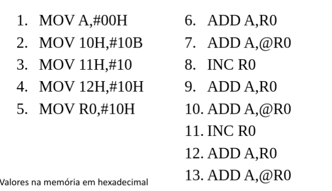
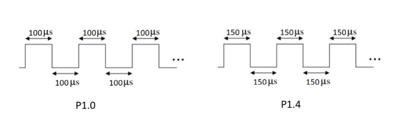
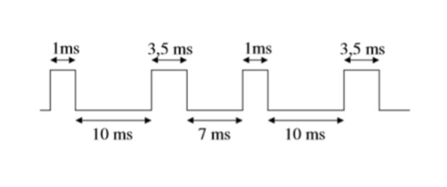
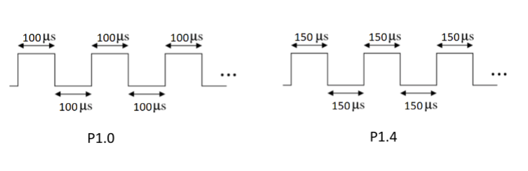
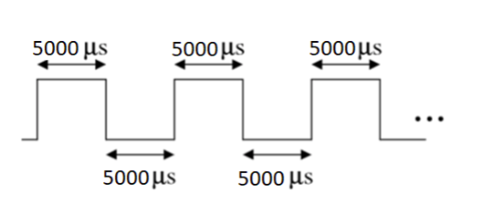
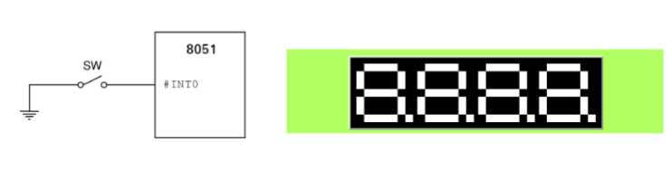

# Enunciados

## Laboratório 01 

**1.** Escreva as instruções para os seguintes casos:

a)Mova para o registrador R1 o valor de 20h;

b)Mova para o acumulador o valor que está no registrador R1;

c)Mova para o endereço 50h o valor de 20h;

d)Mova para o registrador R2 o valor do registrador R1;

e)Incremente o valor que está no registrador R2;

f)Decremente o valor do endereço 50h;

g)Deixe o valor do acumulador como zero;

**2.** Desenvolva um código para as operações a seguir:

a)Some o valor que está no registrador R0 com o do acumulador;

b)Some o valor que está em R0 com o valor que está em R1;

c)Incremente o valor que está em R1 e em seguida some com o valor do acumulador;

d)Some ao acumulador o valor presente no endereço indicado pelo registrador R0 (acesso indireto);

**3.** Quais valores estão na memória depois da execução do código abaixo?

**4.** Escreva um código para as seguintes equações:

a)A = A + R1;

b)A = R0 + R1;

c)A = R0 + 1;

d)A = R0 –1;

e)R2 = R0 + R1;

f)R2 = R0 + R1 (com acesso indireto aos valores de R0 e R1);

## Laboratório 02

**1.** Escreva na memória do programa um número inteiro usando a diretiva DB. Leia o valor que você escreveu na memória do programa usando ainstrução movc, e carregue o conteúdo para o registrador R2.

**2.** Atribua o valor numérico 30haum símbolo usando a diretiva EQU; atribua um valor na memória de dados usando o símbolo; atribua o valor #0FFh ao Acumulador;troque os conteúdos entre o símbolo e o Acumulador usando XCH. ColoquenoacumuladorR2ovalordosímbolo (usar #)

**3.** Divida dois números de 8 bits. Armazene em R5 o quociente e em R4 o resto da divisão de R1 por R0, supondo R0 ≠ 0. Segundo a notação, faça: R5(q) e R4(r) ← R1 / R0.

**4.** Some dois números de 16 bits sem ignorar o Carry. Armazene em [R7 R6 R5] o resultado da soma de [R3 R2] com [R1 R0]. Note aindicação de números de 16 bits por: [MSB LSB]. Ou seja, faça [R7 R6 R5] ← [R3 R2] + [R1 R0].

## Laboratório 03

**1.** bank

1) Carregar no bank 0 seu número de matrícula, desconsiderando o dígito de controle.

2) Copiar no bank1 os valores do bank0;

3) Somar o conteúdo dos registradores do bank1 e armazenar o resultado no R0 do bank3

**2.** Crie um programa que inicie o portP1 com valor Feh, e contenha uma rotina de repetição que fique rotacionando a esquerda o valor do portP1 (neste exercício use a instrução ajmpcom um LABEL).

**3.** Compare dois números inteiros sem sinal que estão localizados em R3 e R4. Armazene o maior em R5 e o menor em R6. Termine o programa com um laço infinito.

## Laboratório 04

## Laboratório 05

**1.** Carregue na memória o seu número de matrícula como um vetor. E programe uma sub-rotina que encontre um valor desejado no vetor e sinalize na porta P1 que o valor foi encontrado.

**2.** Carregue na memória o seu número de matrícula como um vetor. Crie uma sub rotina para determinar o maior elemento de um vetor armazenado na memória RAM interna. Armazenar este maior elemento encontrado na posição de memória logo após o final do vetor.

## Laboratório 06

**1.** Usando o Temporizador, gere pelo pino P1.0  e P1.4 uma onda quadrada conforme imagem abaixo.

**2.** Usando o Temporizador, gere pelo pino P1.0 a forma de onda apresentada:

## Laboratório 07

**1.** Usando o Temporizador, gere pelo pino P1.0  e P1.4 uma onda quadrada conforme imagem abaixo, criando uma sub-rotina da interrupção do temporizador.

**2.** Usando o Temporizador, gere pelo pino P1.0 uma onda quadrada de 200 Hz criando uma sub-rotina da interrupção do temporizador.

**3.** Crie um programa com interrupção acionado pelocontador, que realize uma contagem do pino TO(pinoP3.4), ainterrupção deve ser acionada para umacontagem de 20 e que realize o complemento do pinoP1.7nasub-rotinacada vez que a interrupção for acionada.A contagem deve ser interrompida usando pino INT0 (P3.2)

## Laboratório 08

## Laboratório 09

**1.** Para o esquema apresentado na figura e considerando a chave SW0, escreva um programa que, como uso da interrupção (INT0 ou INT1), apresente no display de 7 segmentos o número de acionamentos da chave (a contagem deve ser de 0 até 9, voltando a zero quando estoura).

