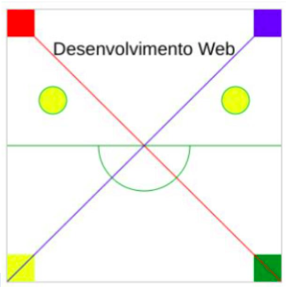
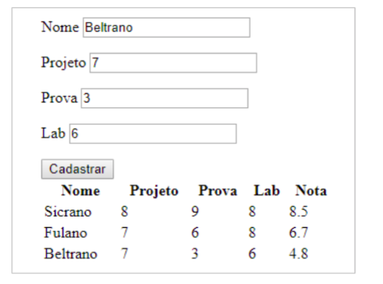
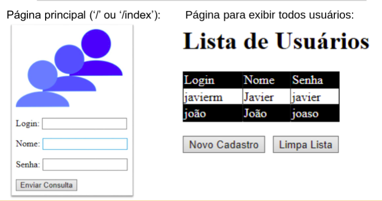
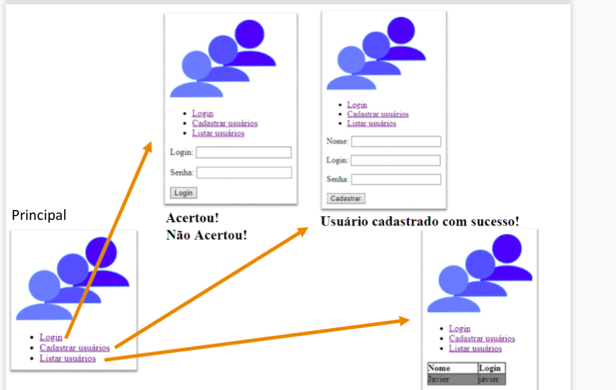
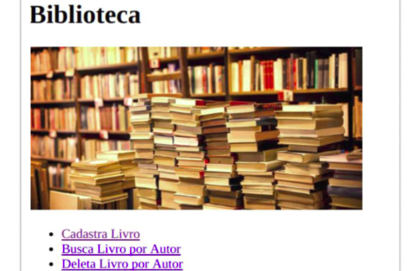

# Enunciados

## Laboratório 01 

Crie duas páginas HTML utilizando estilos CSS. As páginas devem ter:

Regras utilizando seletores de classe, id e tago

Regras definidas no atributo style(inline), na própria página (incorporado) e em um arquivo css separado (linkado).

Regras utilizando pseudo-classes“ : ” (Ex.: div:hover)

## Laboratório 02

Crie duas páginas HTML utilizando estilos CSS. As páginas devem ter:

Regras utilizando seletores de classe, id e tago

Regras definidas no atributo style(inline), na própria página (incorporado) e em um arquivo css separado (linkado).

Regras utilizando pseudo-classes“ : ” (Ex.: div:hover)

## Laboratório 03
Criar um website com pelo menos 6 páginas
Seu site deverá ter:

Um menu em todas as páginas

Várias imagens

Tabelas

Links para outras páginas na WEB

Vídeos do Youtube ou mapas do Google maps

## Laboratório 04

Faça um página HTML contendo uma caixa de texto e um botão. Toda vez que o usuário clicar no botão, o texto da caixa deverá ficar maiúsculo

No mesmo arquivo HTML, faça um script que mude o destino de um link ao fazer o click de um botão.

## Laboratório 05

Crie um elemento canvas

Desenhe as formas conforme exemplo ao lado, nas posições e nas cores corretas.

Configure o canvaspara ter tamanho 300x 300

Formas

Utilize uma função diferente para cria cada tipo de forma: desenharRetangulos()  desenharLinhas()  desenharArcos()  escrever()

## Laboratório 06

Criação de objetos Aluno

Atributos: Nome, Lab, Projeto, Prova e Nota

Métodos: calculaNota(), imprime()

## Laboratório 07

Crie um servidor WEB com Node.js utilizando o pacote Express. 

Crie quatro páginas HTML, todas com imagens, JavaScript e CSS.

## Laboratório 08

Desenvolver e servir duas páginas("ejs"):

Uma de cadastro de usuário(‘/’ou‘/index’): login, nome e senha.

Uma para exibir todos os usuários cadastrados que deve contar com um botão que permite fazer um novo cadastro e um outro botão para limpar a lista de usuários.Esta segunda página é exibida assim que um novo cadastro for realizado.

## Laboratório 09

Hoje (uso de Mongo DB) -> com o último lab

A conversão do espaço ocupado em disco, de bytes para megabytes deverá ser feita  através  de  uma  função  separada,  que  será  chamada  pelo  programa principal. O cálculo do percentual de uso também deverá ser feito através de uma função, que será chamada pelo programa principal.

## Laboratório 10

Programar o servidor para servir a página principal, exibida no slide anterior,e todas as outras páginas referentes aos links, interagindo com um banco de dados

## Laboratório 11

Construa uma aplicação Web utilizando todo o conteúdo aprendido na disciplina (foco principal no Node.js e MongoDB):

Pelo menos 5 páginas, onde pelo menos 2 devem ser dinâmicas. 

Conteúdo estático: css, imagens, etc. (não pode utilizar projetos antigos)

No mínimo duas coleções no banco de dados (dois schemas,dois modelos,etc.): isso quer dizer que dois tipos de dados serão armazenados no mesmo banco 

Banco de dados com autenticação

## Prova

