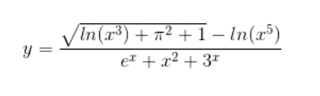
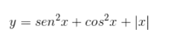

# Enunciados

## Laboratório 01 

**1.** Faça um Programa que mostre a mensagem "Primeiro Programa em Python" na tela.

**2.** Faça um programa que solicita que o usuário entre com seu próprio nome e, depois, imprima o nome do usuário na tela.

**3.** Leia 2 valores inteiros e armazene-os nas variáveis A e B. Efetue a soma de Ae B e imprima o resultado na tela.

**4.** A fórmula  para  calcular  a  área  de  uma  circunferência  é: area  = π  * raio2. Considerando que π = 3.14159, efetue o cálculo da área para o valor de raio obtido do usuário. Exiba o resultado.

**5.** Faça um Programa que peça a temperatura em graus Fahrenheit, transforme e mostre a temperatura em graus Celsius. C = (5 * (F-32) / 9)6.

**6.** Faça um Programa que peça as notas de LAB, P1 e P2 e mostre a média da disciplina. M = (LAB + 2*P1 + 3*P2) / 6

## Laboratório 02

**1.** Faça um programa que lê um valor inteiro entre 1 e 12. Correspondente a este valor, deve ser apresentado como resposta o mês do ano por extenso. 

**2.** Escreva um programa que lê um número inteiro e responde se este número é positivo, negativo ou zero.

**3.** Faça um programa que lê um número inteiro e determina se este número é par ou ímpar (dica: utilize o operador % - resto da divisão).

**4.** Faça um programa que lê um valor x para calcular e imprimir o valor da função y de acordo com as condições:

Se x >= 5: 

Se x < 5: 

**5.** Faça um programa que lê três valores, a, b e c, que correspondem a lados de um triângulo, para calcular, classificar e imprimir os triângulos de acordo com a regra: 

Se a² = b² + c² o triângulo é retângulo. 

Se  a² > b² + c² o triângulo é obtusângulo.

Se  a² < b² + c² o triângulo é acutângulo

Obs: Considerar que a é o maior dos três lados.

**6.** Leia 3 valores inteiros e ordene-os em ordem crescente. No final, mostre os valores em ordem crescente, uma linha em branco e em seguida, os valores na sequência como foram digitados.

## Laboratório 03

**1.** Faça um programa que faça 5 perguntas para uma pessoa sobre um crime. As perguntas são:

● “Telefonou para a vítima?”

● “Esteve no local do crime?”

● ‘Mora perto da vítima?”

● “Devia para a vítima?”

● “Já trabalhou com a vítima?” 

Então,  o  programa  deve  emitir  uma  classificação  sobre  a  participação  da pessoa no crime. Se a pessoa responder positivamente a 2 questões, ela deve ser classificada como "Suspeita", entre 3 e 4 como "Cúmplice" e 5 como "Assassino". Caso contrário, ele será classificado como "Inocente".

**2.** Faça um programa para o cálculo de uma folha de pagamento, sabendo que os  descontos  são  do  Imposto  de  Renda,  que  depende  do  salário  bruto (conforme tabela abaixo) e 10% para INSS e que o FGTS corresponde a 11% do Salário Bruto, mas não é descontado (é a empresa que deposita). O Salário  Líquido  corresponde  ao  Salário  Bruto  menos  os  descontos.  O programa deverá pedir ao usuário o valor da sua hora e a quantidade de horas trabalhadas no mês

Desconto do IR:

○ Salário Bruto até 900 (inclusive) - isento

○ Salário Bruto até 1500 (inclusive) - desconto de 5%

○ Salário Bruto até 2500 (inclusive) - desconto de 10% 

○ Salário Bruto acima de 2500 - desconto de 20% 

Imprima na tela as informações dispostas conforme o exemplo abaixo. No exemplo, o valor da hora é R$ 5,00 e são 220 horas trabalhadas

**3.** Faça um programa que calcule as raízes de uma equação do segundo grau, na forma ax2 + bx + c. O programa deverá pedir os valores de a, b e c e fazer as consistências, informando ao usuário as seguintes situações:

a. Se o usuário informar o valor de a igual a zero, a equação não é do segundo grau e o programa não deve pedir os demais valores, sendo encerrado;

b. Se o delta calculado for negativo, a equação não possui raízes reais. Informe ao usuário e encerre o programa;

c. Se o delta calculado for igual a zero a equação possui apenas uma raiz real; informe-a ao usuário;

d. Se o delta for positivo, a equação possui duas raiz reais; informe-as ao usuário

**4.** Um posto está vendendo combustíveis com a seguinte tabela de descontos:

a. Álcool:

i.até 20 litros, desconto de 3% por litro

ii.acima de 20 litros, desconto de 5% por litro

b.Gasolina:

i.até 20 litros, desconto de 4% por litro

ii.acima de 20 litros, desconto de 6% por litro 

Escreva um programa que solicita o número de litros vendidos e o tipo de combustível (álcool ou gasolina). Então, calcula e imprime o valor a ser pago pelo cliente sabendo-se que o preço do litro da gasolina é R$ 4,20 e, do álcool, R$ 2,80.

**5.** Um zoológico em particular determina o preço da entrada com base na idade do visitante. Os visitantes com 2 anos de idade ou menos têm entrada gratuita. Crianças entre 3 e 12 anos pagam R$ 14,00. Idosos com 65 anos ou mais pagam R$ 18,00. A entrada para todos os outros visitantes custa R$ 23,00. Crie um programa que comece lendo as idades de todos os visitantes de um mesmo grupo, sendo uma idade informada em cada linha. O usuário digitará uma linha em branco para indicar que não há mais pessoas no grupo. Em seguida, seu programa deve exibir o custo total para o grupo. O custo deve ser exibido usando duas casas decimais.

**6.** Faça um programa para um caixa eletrônico. O programa deverá perguntar ao usuário o valor do saque e depois informar quantas notas de cada valor serão fornecidas. As notas disponíveis são as de 1, 5, 10, 50 e 100 reais. O valor mínimo de saque é de 10 reais e o máximo de 600 reais. O programa não deve se preocupar com a quantidade de notas existentes na máquina.

a. Exemplo 1: Para sacar a quantia de 256 reais, o programa fornece duas notas de 100, uma nota de 50, uma nota de 5 e uma nota de 1;

b. Exemplo 2: Para sacar a quantia de 399 reais, o programa fornece três notas de 100, uma nota de 50, quatro notas de 10, uma nota de 5 e quatro notas de 1.