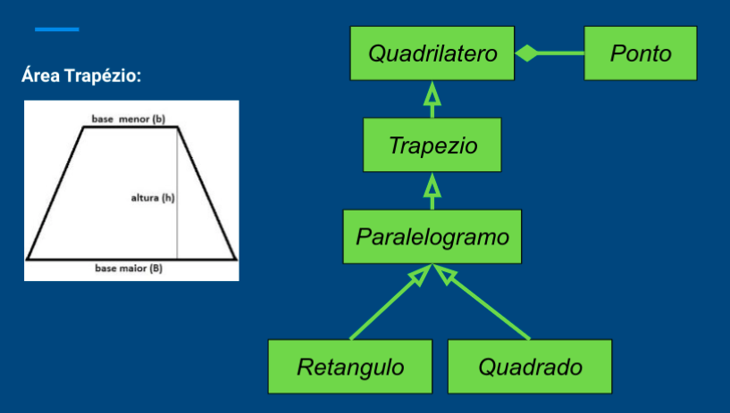
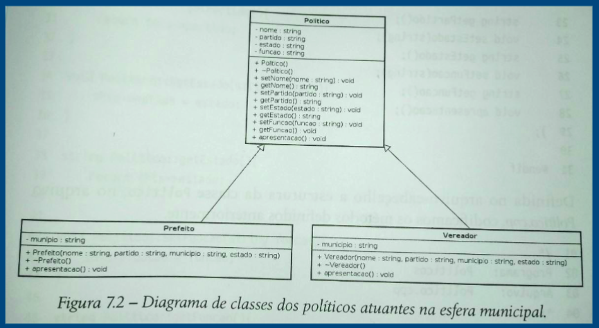
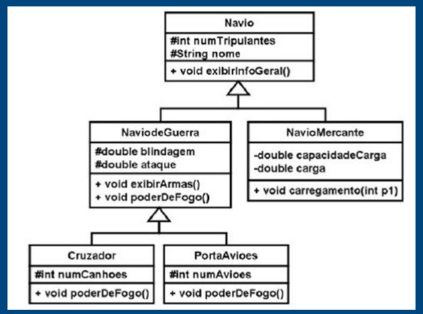
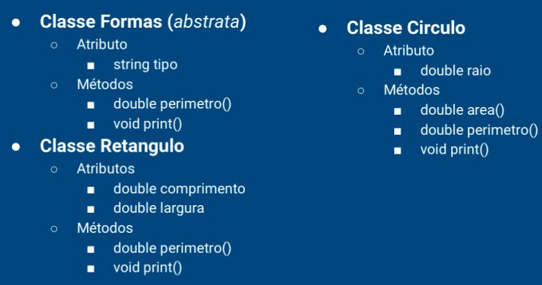
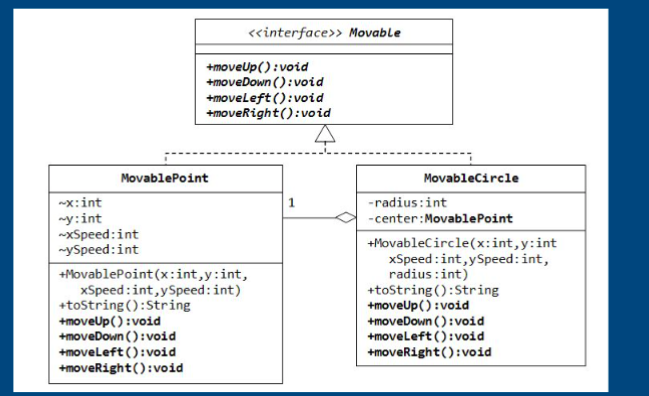
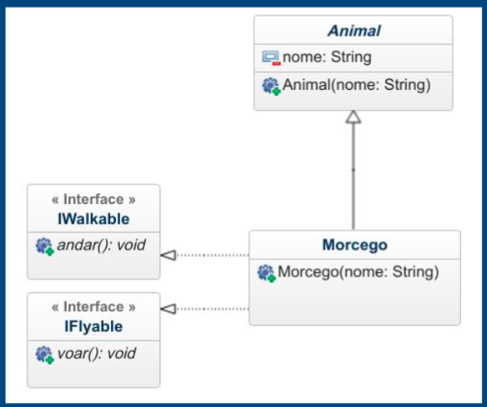
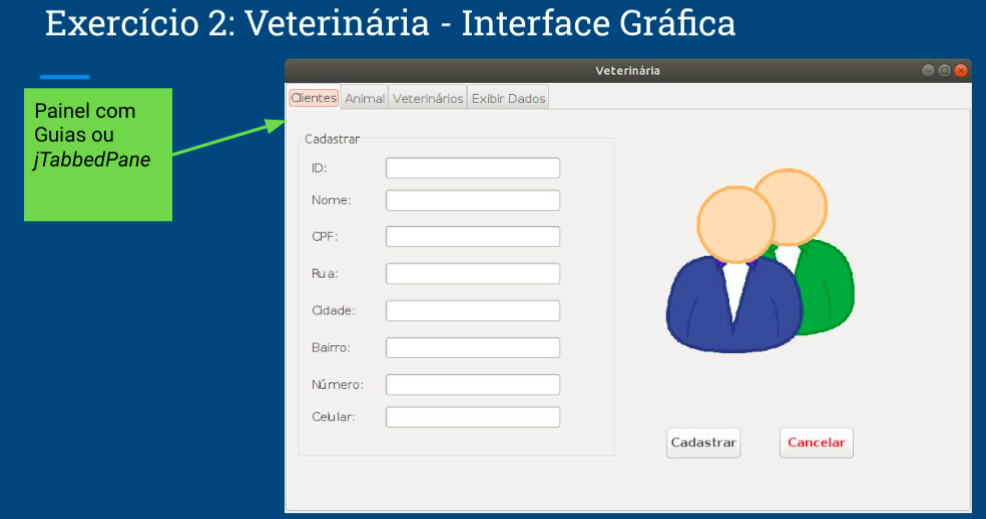
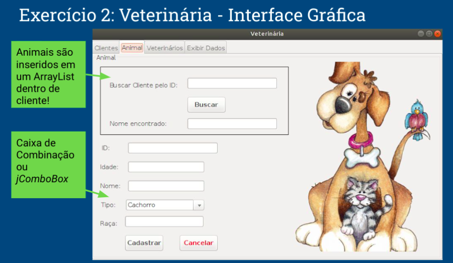
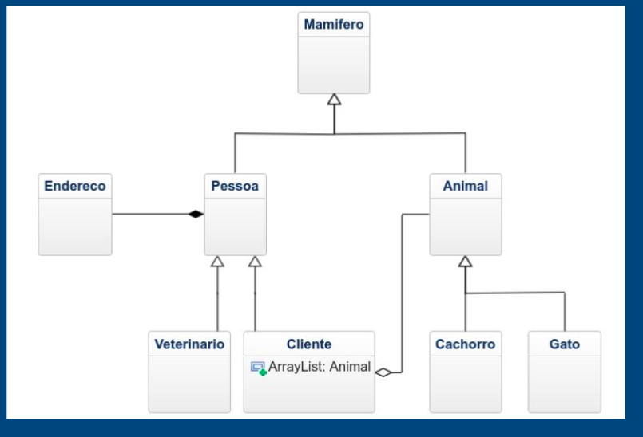
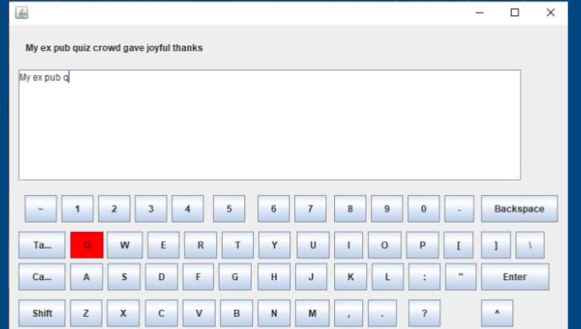

# Enunciados

## Laboratório 01 

**1.** Faça um programa que retorne o produto de três números reais.

**2.** Leia 3 valores inteiros e os ordene em ordem crescente. No final, mostre os 3 valores ordenados.

**3.** Faça um programa que exibe os números ímpares entre 1 e 1000.

**4.** Faça um programa que lê 20 números. Então, mostre a quantidade de valores positivos que foram digitados.

**5.** (5.17 Deitel) Uma empresa que faz negócio por reembolso postal vende cinco produtos cujos preços de varejo são como segue: Produto 1, $ 2.98; Produto 2, $ 4.50; Produto 3, $ 3.98; Produto 4, $ 4.49, Produto 5, $ 6.87. Escreva um aplicativo que leia uma série de pares de números como segue: 

a) número do produto; 

b) quantia vendida.

Seu programa deve utilizar uma instrução switch para determinar o preço de venda de cada produto. Você deve calcular e exibir o valor de varejo total de todos os produtos vendidos. Utilize um loop controlado por sentinela para determinar quando o programa deve parar o loop e exibir os resultados finais. 

**6.** URI (2454)

**7.** URI (1048)

**8.** Escreva um aplicativo que lê 5 números entre 1 e 30. Para cada número lido, seu programa deve imprimir o mesmo número de asteriscos adjacentes. Por exemplo, se seu programa lê os números: 1, 3, 10, 2 e 5, ele deve imprimir:

*

***

*********

**

*****

**9.** (Triplos  de  Pitágoras)  Um  triângulo  retângulo  pode  ter  lados  que  são  todos inteiros.  Um  conjunto  de  três  valores  inteiros  para  os  lados  de  um  triângulo retângulo é chamado de triplo de Pitágoras. Esses três lados devem satisfazer o relacionamento de que a soma dos quadrados de dois dos lados seja igual ao quadrado da hipotenusa. Localize todos os triplos de Pitágoras para lado1, lado2 e  hipotenusa,  todos  não  maiores  que  500.  Utilize  um  loop  for  triplamente aninhado que tente todas as possibilidades. Esse é um exemplo de computação baseada na força bruta.

## Laboratório 02

**1.** Crie a classe Pessoa

Variáveis: cpf e nome, ambos private e do tipo String. idade private e int

Métodos: set e get para cada um dos atributos

main( ):

○ Classe TestePessoa

○ crie três objetos (p1, p2 e p3) do tipo Pessoa

○ obtenha pelo teclado o valor de cpf,nome e idade para p1, p2 e p3

○ inicialize os atributos de p1, p2 e p3 com os métodos set 

○ exiba o conteúdo dos atributos de p1, p2 e p3 utilizando o método get

**2.** Crie a classe Swapper

Variáveis: x e y, ambos private e do tipo float.

Métodos: 

○ set e get para cada um dos atributos

○ void swap( ) que troca os valores de x e y

main( ):

○ classe SwapperDemo○crie um objeto, chamado troca, do tipo Swapper

○ obtenha pelo teclado o valor de x e y para o objeto troca

○ inicialize os atributos de troca comos métodos set

○ utilize o método swap( ) para trocar os valores de x e y

○ exiba os valores trocados utilizados os métodos get

**3.** Classe Retângulo

Atributos: lado1 e lado2, ambos private e do tipo int

Métodos: 

○ set e get para os atributos

○ area( ), que retorna a área do retângulo

○ perimetro( ), que retorna o perímetro do retângulo

main( ):

○ crie dois objetos (ret1 e ret2) do tipo Retangulo

○ obtenha pelo teclado o valor de lado1 e lado2 para ret1 e ret2

○ inicialize os atributos de ret1 e ret2 com os métodos set

○ exiba o conteúdo dos atributos de ret1 e ret2 utilizando os gets

○ exiba o perímetro e a área dos objetos ret1 e ret2 por meio dos métodos area( ) e perimetro( ) 

**4.** Classe Televisão

Atributos: 

○ modelo - private e do tipo string

○ preco e tamanho - private e do tipo float

○ volume e canal - private int

○ ligada - private boolean

Métodos: 

○ set e get para todos atributos 

○ alteraVolume( int ) - aumenta ou diminui o valor atual de volume, dado arg

○ alteraCanal( int ) - aumenta ou diminui o valor atual de volume, dado arg

main(): 

○ crie dois objetos (tv1 e tv2) do tipo Televisao

○ obtenha pelo teclado os valores dos atributos e inicialize com set

○ altere o volume e o canal de tv1 e tv2

○ desligue a tv2

**5.** (3.15 adaptado Deitel) - Crie uma classe chamada Data que inclui três partes de informações como variáveis de instância: um mês (tipo int), um dia (tipo int) e um ano (tipo int). Forneça um método set e um get para cada variável de instância. Forneça um método exibeData que exibe o mês, o dia e o ano separados por barras normais ( / ). Escreva um aplicativo chamado DataTeste, que demonstra as capacidades da classe Data.

**6.** (3.14 adaptado Livro Deitel) – Crie uma classe chamada  Funcionario com três partes de informações como atributos: um nome (tipo  string), um sobrenome (tipo  string) e um salário mensal (tipo  double). Forneça uma função  set e uma função  get para cada atributo. Se o salário mensal não for positivo, configure-o como 0 (zero). Forneça uma função que retorna o salário anual de Funcionario. Escreva um programa de teste que demonstre as capacidades da classe Funcionario. Crie dois objetos da classe Funcionario; utilize a função set para entrar com as informações de cada Funcionario (nome, sobrenome e salário mensal ) e exiba o salário  anual de cada um. Então, dê a cada Funcionario um aumento de 10% e exiba novamente o salário  anual de cada um.

**7.** (Deitel 3.13) Crie uma classe chamada Invoice que uma loja de suprimentos de informática possa utilizar para representar uma fatura de um item vendido na loja. Uma Invoice (fatura) deve incluir quatro partes de informações como atributos — um número identificador (tipo string), uma descrição (tipo string), a quantidade comprada de um item (tipo int) e o preço por item (tipo double). Forneça uma função set e uma função get para cada membro de dados. Além disso, forneça um método chamado getInvoiceAmount que calcula a quantia da fatura (isto é, multiplica a quantidade pelo preço por item) e depois retorna a quantidade como um valor double.

## Laboratório 03

**1.** Classe Funcionario aprimorada
Aprimore a sua classe Funcionario (ex. 6 da última aula) com o seguinte:

● adicione os atributos: int idade, string sexo, int numero

● Faça um construtor padrão (sem parâmetro nenhum) para inicializar o objeto.

● Faça um construtor com 6 parâmetros, um para cada atributo.

● Teste a classe instanciando vários objetos da classe Funcionario.

**2.** Classe Data aprimorada

(Deitel 8.16) Crie uma classe Data com as seguintes capacidades:

A.Gerar saída em múltiplos formatos:i.MM/DD/YYYYii.Março 02, 2019iii.DDD YYYY

B.Utilizar construtores sobrecarregados para criar objetos Data inicializados com datas nos formatos da parte (A). No primeiro caso, o construtor deve receber 3 valores inteiros. No segundo caso deve receber uma String e dois valores inteiros. No terceiro caso deve receber dois valores inteiros, o primeiro sendo o número de dias no ano. [Dica: para converter a representação de string do mês em valor numérico, compare as strings utilizando o método equals. Por exemplo, se s1 e s2 forem strings, a chamada de método s1.equals(s2) retornará true se as strings forem idênticas. 

**3.** Classe HeartRates

3.16 (Calculadora da frequência cardíaca) Durante o exercício, você pode usar um monitor de freqüência cardíaca para verificar se sua frequência cardíaca permanece dentro de um intervalo seguro sugerido por seus treinadores e médicos. A fórmula para calcular sua frequência cardíaca máxima em batimentos por minuto é 220 menos a sua idade em anos. A sua frequência cardíaca alvo é um intervalo que representa 50 a 85% da sua frequência cardíaca máxima. Crie uma classe chamada HeartRates. Os atributos da classe devem incluir o nome, sobrenome e data de nascimento da pessoa (que consistem em atributos separados para o mês, dia e ano de nascimento). Sua classe deve ter um construtor que receba esses dados como parâmetros. Para cada atributo, forneça os métodos set e get. A classe também deve incluir um método que calcula e retorna a idade da pessoa (em anos), um método que calcula e retorna a frequência cardíaca máxima da pessoa e um método que calcula e retorna a freqüência cardíaca alvo da pessoa.

Escreva um aplicativo Java que solicite as informações da pessoa, instancia um objeto da classe HeartRates e imprima as informações desse objeto - incluindo o nome, sobrenome e data de nascimento da pessoa - e calcule e imprima a idade da pessoa em (anos), freqüência cardíaca máxima e faixa de freqüência cardíaca alvo.

**4.** Classe Racional

(Deitel 8.17) Crie uma classe chamada Racional para realizar aritmética com frações. Utilize variáveis do tipo  inteiro para representar as variáveis de instância private da classe: o  numerador e o denominador.   Forneça um construtor que permita que um objeto dessa classe seja inicializado quando ele for declarado. O construtor deve armazenar a fração em uma forma reduzida, por exemplo, a fração 2/4 é equivalente a 1/2 e seria armazenada no objeto como 1 no  numerador e 2 no  denominador . Forneça um construtor sem argumento com valores padrão caso nenhum inicializador seja fornecido. Forneça métodos  public que realizam cada uma das operações a seguir:

a) Somar dois números  Racional : o resultado da adição deve ser armazenado na forma reduzida. 

b) Subtrair dois números  Racional : o resultado da subtração deve ser armazenado na forma reduzida. 

c) Multiplicar dois números  Racional : o resultado da multiplicação deve ser armazenado na forma reduzida. 

d) Dividir dois números  Racional : o resultado da divisão deve ser armazenado na forma reduzida. 

e) Retornar uma representação  String de um número  Racional na forma a/b,   onde  a  é o  numerador  e  b  é o  denominador. 

f) Retornar uma representação  String de um número  Racional no formato de ponto flutuante. (Considere a possibilidade de fornecer capacidades de formatação que permitam que o usuário da classe)

**5.** Classe Complex

(Deitel 8.11)  Crie uma classe chamada Complex para executar aritmética com números complexos. Números complexos têm a forma: parteReal + parteImaginaria * i , onde i = sqrt(-1).Escreva um programa para testar sua classe. Use variáveis float  para as variáveis private da classe. Forneça um construtor que permita que um objeto desta classe seja inicializado quando declarado. Forneça também um construtor sem argumento com valores padrão, caso nenhum inicializador seja fornecido. Providencie métodos públicos que executam as seguintes operações:

a) Adicione dois números complexos: as partes reais são somadas e as partes imaginárias são somadas.

b) Subtraia dois números complexos: A parte real do operando direito é subtraída da parte real do operando esquerdo e a parte imaginária do operando direito é subtraída da parte imaginária do operando esquerdo.

c) Imprima números complexos

**6.** Agregação

**7.** Composição

## Laboratório 04

**1.** Crie um vetor (com 10 posições) para armazenar sensores a Laser (classe Laser):

a.Crie a classe Laser. Cada Laser deve conter os seguintes atributos: fabricante, alcance, precisão e medida

b.Depois de criados os 10 objetos Laser, leia as medidas obtidas por cada um deles

**2.** Escreva um programa em Java que compara dois ArrayLists. Para isso, crie dois ArrayLists de String e, em cada um, insira nomes de cores. Então, compare ambos para ver se o conteúdo é igual. A sequência das cores não precisa ser a mesma.

**3.** Escreva um programa em Java que copia um ArrayList para outro ArrayList. Para isso, crie um ArrayList de String e insira nomes. Então copie o ArrayList criado em outro ArrayList.

Crie um programa que recebe do usuário um mês e um dia. O usuário entrará o nome do mês como uma string, seguido do dia do mês como um inteiro. Então, seu programa deve exibir a estação associada à data que foi introduzida.

**4.** PhoneBook

Escreva uma classe PhoneBook que tenha como variáveis de instância o nome (private) de uma pessoa e o seu telefone (private). O construtor dessa classe deve ter como parâmetros as duas variáveis previamente definidas. Em seguida, escreva um programa que tenha como entrada as seguintes opções:

● n: Cria uma nova pessoa na agenda:solicita o nome: entra com o nome da pessoa que será criadasolicita o telefone: entra com o telefone da pessoa

● d: Deleta uma pessoa da agenda:solicita o nome: entra com nome da pessoa que será excluída

● p: Imprime toda a agenda.

● q: sai do programa

**5.** Xadrez

Supondo que você vá programar um jogo de xadrez, construa uma classe Peça, com atributos tipo, cor e posição (formada por coluna e linha - ex: “a7”). Crie um ArrayList para armazenar objetos dinâmicos do tipo Peça. Armazene 32 peças, sendo 16 brancas e 16 pretas, com os seguintes tipos:○8 peões ; 2 torres ; 2 cavalos ; 2 bispos ; 1 rainha e 1 rei . Depois encontre uma peça pela posição e a remova do ArrayList. Imprima todos as peças restantes.

**6.** ContaCorrente

Cria uma classe ContaCorrente com o atributo saldo e os métodos: sacar, depositar e getSaldo. Crie um ArrayList com todas as ContasCorrentes e utilize os métodos sacar, depositar e getSaldo de cada uma.

**7.** Carro

Construa uma classe Carro, composta por objetos de várias outras classes: Roda, Motor, Porta, Banco, Volante etc. Crie pelo menos 10 classes para compor Carro. Muitos objetos que compõe carro serão manipulados por meio de ArrayLists, como objetos da classe Roda, por exemplo.

## Laboratório 05

**1.**  Implemente no Java

**2.** Implemente no Java

(Deitel  9.8)  Escreva  uma  hierarquia  de  herança  para  as  classes Quadrilatero, Trapezio, Paralelogramo, Retangulo  e Quadrado.  Use Quadrilatero como superclasse da hierarquia. Crie e use uma classe Ponto  para  representar  os  pontos  (x,  y)  de  cada  forma.  Faça  a hierarquia  o  mais  profunda  (isto  é,  com  muitos  níveis)  possível. Especifique as variáveis de instância e os métodos para cada classe. As variáveis de instância private de Quadrilatero devem ser Pontospara  os  quatro  pontos  que  delimitam  o  quadrilátero.  Escreva  um programa que instancia objetos de suas classes e gera saída da área de  cada  objeto  (exceto Quadrilatero).  A  entrada  será  feita  com  a posição de 4 pontos (x, y).

**3.** Sistema Político Brasileiro

**4.** Hierarquia Navio

**5.** Account

(Deitel 12.10) ( Hierarquia de herança de Account ) Crie uma hierarquia de herança que um banco possa utilizar para representar as contas bancárias dos clientes. Todos os clientes nesse banco podem depositar (isto é, creditar) dinheiro em suas contas e retirar (isto é, debitar) o dinheiro delas. Há também tipos mais específicos de contas. As contas de poupança, por exemplo, recebem juros pelo dinheiro depositado nelas. As contas bancárias, por outro lado, cobram uma taxa por transação (isto é, crédito ou débito). 

Crie uma hierarquia de herança contendo a superclasse  Account e as subclasses  SavingsAccount e  CheckingAccount que herdam da classe Account.   A superclasse  Account deve incluir um membro de dados do tipo double para representar o saldo da conta. 

A classe deve fornecer um construtor que recebe um saldo inicial e o utiliza para inicializar o membro de dados. O construtor deve validar o saldo inicial para assegurar que ele é maior que ou igual a 0.0. Caso contrário, o saldo deve ser configurado como 0.0 e o construtor deve exibir uma mensagem de erro, indicando que o saldo inicial era inválido. A classe deve fornecer três funções-membro. A função-membro  credit deve adicionar uma quantia ao saldo atual. A função-membro  debit deve retirar dinheiro de  Account e assegurar que o valor do débito não exceda o saldo de  Account.   Se exceder, o saldo deve permanecer inalterado e a função deve imprimir a mensagem “Saldo insuficiente”. A função-membro  getBalance  deve retornar o saldo atual. A subclasse  SavingsAccount deve herdar a funcionalidade de uma Account,   mas também incluir um membro de dados do tipo double para indicar a taxa de juros (porcentagem) atribuída à  Account .

O construtor SavingsAccount deve receber o saldo inicial, bem como um valor inicial para a taxa de juros de  SavingsAccount.    SavingsAccount deve fornecer uma função-membro public  calculateInterest que retorna um double para indicar os juros auferidos por uma conta. A função-membro calculateInterest  deve determinar esse valor multiplicando a taxa de juros pelo saldo da conta. [Nota:  SavingsAccount deve herdar as funções-membro  credit  e  debit  exatamente como são sem redefini-las.] A subclasse  CheckingAccount deve herdar da classe básica  Account e incluir um membro adicional de dados do tipo double que representa a taxa cobrada por transação. O construtor  CheckingAccount deve receber o saldo inicial, bem como um parâmetro que indica o valor deuma taxa. A classe  CheckingAccount deve redefinir as funções-membro credit e  debit para que subtraiam a taxa do saldo da conta sempre que qualquer uma das transações for realizada com sucesso. 

As versões CheckingAccount dessas funções devem invocar a versão  Account da classe básica para realizar as atualizações de saldo de uma conta. A função debit  CheckingAccount  deve cobrar uma taxa somente se o dinheiro for realmente retirado (isto é, o valor do débito não exceder ao do saldo da conta). [Dica: Defina a função  debit de  Account para que ela retorne um bool indicando se houve retirada de dinheiro. Em seguida, utilize o valor de retorno para determinar se uma taxa deve ser cobrada.]

## Laboratório 06

**1.** Sobrecarga de Métodos 

Crie uma classe, em Java, para calcular o quadrado de um número. A classe deve conter o método square() que aceita parâmetro inteiro ou double. 

**2.** Implementar o polimorfismo na hierarquia de classes Formas

**3.** Matrix.

Dada a definição acima de Matrix, implemente as classes Empresario, Professor e Advogado como subclasses da classe Agente:

A classe Agente tem os seguintes atributos: String nome;  boolean modo_agente; String profissao; o método abstrato void apresentacao() e o método modo_agente_on();

A classe Empresario deve ter os atributos: String nome; boolean modo_agente; String profissao, String empresa; e o método void apresentacao();

A classe Professor deve ter os atributos: String nome; boolean modo_agente; String profissao, String escola; e o método void apresentacao();

A classe Advogado deve ter os atributos: String nome; boolean modo_agente; String profissao, String OAB; e o método void apresentacao()

No método main( ) a explicação de Matrix deve ser implementada. Um ArrayList de n pessoas do tipo Agente deve ser definido. Então, com um loop infinito, faça um menu para criar pessoas com diferentes profissões dentro deste ArrayList. Coloque uma opção no menu para todas as pessoas se apresentarem.

Escolha algumas pessoas para invocar o método modo_agente_on() e transformá-las em Agentes. Cuidado: os objetos não podem ser instanciados como Agentes (classe abstrata), mas inclua um print no método apresentacao() que leia o atributo modo_agente e imprima “AGENTE SMITH”, para modo_agente = true.

**4.**  Implemente o Diagrama de Classes  apresentado abaixo. 

**5.** Implemente o Diagrama de Classes ao lado. Crie também uma classe para testar o funcionamento de objetos da classe Morcego.

## Laboratório 07

**1.** Faça uma classe Pessoa, com um construtor de 4 parâmetros: nome, sobrenome, idade e CPF. O programa deve gerar uma exceção específica (crie uma classe de exceção) caso o CPF seja digitado com caracteres especiais (ponto e hífen). A mensagem exibida, neste caso, deve indicar qual foi o erro.

No programa principal o objeto pessoa será instanciado com os 4 dados sendo digitados pelo usuário. No caso de erro, o CPF deve ser digitado novamente

**2.** Faça com que os objetos da sua classe PhoneBook possam armazenar de forma permanente os contatos criados. A armazenagem deve ser feita com o uso de arquivos.

**3.** Crie uma aplicação que recebe um nome completo de uma pessoa e utiliza um padrão Factory para escolher dentre dois objetos, que possuem diferentes formas de impressão. Seu programa deve escolher dentre as duas fábricas aleatoriamente.Utilize o padrão Singletonpara garantir que exista somente uma fábrica de objeto de cada tipo no código principal.

**4.** Deitel 21.8 - Crie uma classe genérica Pair que tem dois parâmetros de tipo - F e S, cada um representando, respectivamente, o tipo do primeiro e o do segundo elemento do par. Adicione os método set e get ao primeiro e ao segundo elemento do par.

## Laboratório 08

**1.** Para treinar, faça novamente o exemplo de adicionar dois números, separando, pelo menos, o M (Model) do V (View). Faça o Model em um pacote e o View em outro. O Model deve conter a lógica!

**2.** Crie um novo projeto chamado Calculadora: Crie uma classe Calculadora; Crie um JFrame e adicione todos os componentes GUI necessários; Faça a calculadora funcionar com as 4 operações básicas (+ ,  -  , * ,  /) Não use estrutura condicional (if / else / switch / case) , utilize o Design Pattern Strategy! Utilize Herança, Polimorfismo e Classe Abstrata!

## Laboratório 09

**1.**  Cadastro permanente de usuários e tela de exibição por CPF

**2.**  Veterinária

## Laboratório 10

**1.** Datilografia

(Deitel 14.20) Digitar de forma rápida e correta é uma habilidade essencial para trabalhar efetivamente com computadores e a Internet. Neste exercício, você vai construir uma aplicação gráfica que ajuda os usuários a aprenderem a “datilografar” (ou seja, digitar corretamente sem olhar para o teclado). 

O aplicativo deve exibir um teclado virtual e deve permitir ao usuário que ele veja o que está digitando na tela sem olhar para o teclado real. Use JButtonspara representar as teclas. À medida que o usuário pressiona cada tecla, o aplicativo destaca o JButtoncorrespondente na GUI e adiciona o caractere a uma JTextArea que mostra o que o usuário digitou até o momento.

Para destacar um JButton, use seu método setBackground para alterar a cor de seu plano de fundo; Quando a tecla for liberada, redefina sua cor de fundo original. Você pode obter as cores originais dos botões JButton com o método getBackground antes de alterar sua cor.

Você pode testar seu programa digitando um pangrama - uma frase que contém todas as letras do alfabeto pelo menos uma vez - como "the quick brown fox jumped over a lazy dog". 

Para tornar o programa mais interessante, você deve monitorar a precisão do usuário. Você deve usar os pangramas exibidos na tela acima do teclado virtual. Então, você acompanha (conta) quantas teclas o usuário digita corretamente e quantas são digitadas incorretamente.

