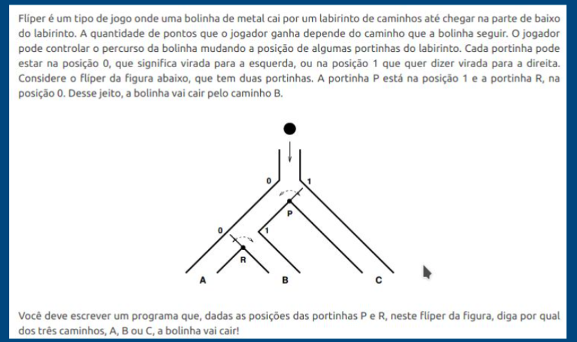
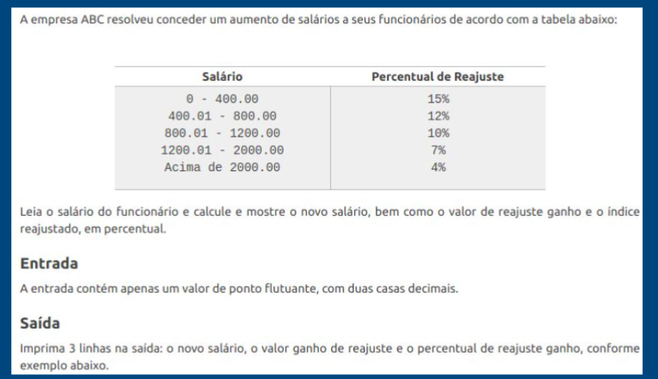
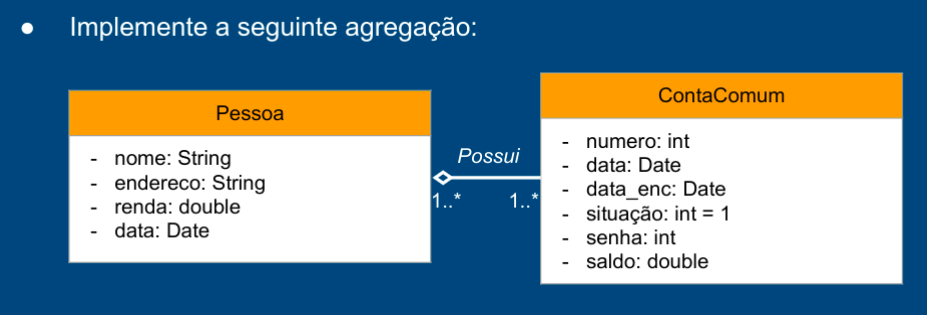
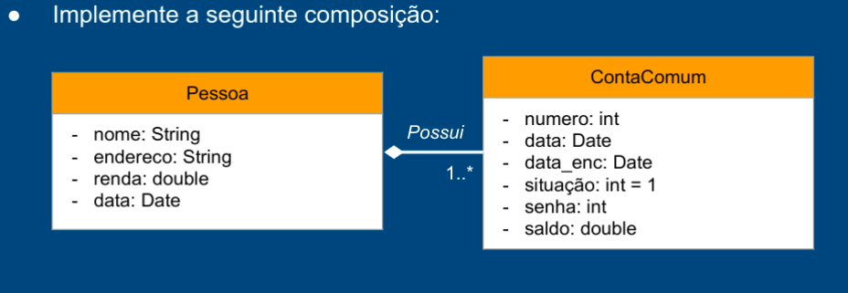
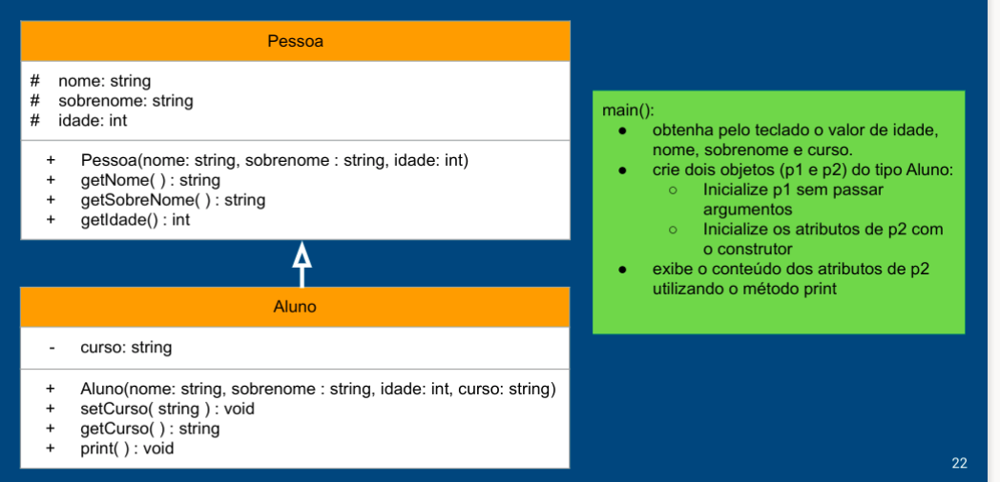
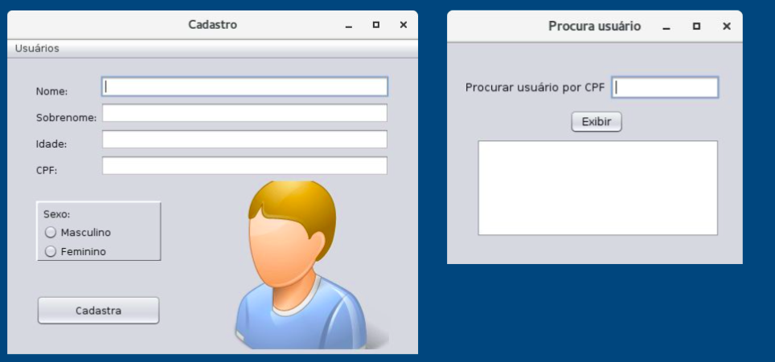

# Enunciados

## Laboratório 01 

**1.** Faça um programa que retorne o produto de três números reais.

**2.** Leia 3 valores inteiros e os ordene em ordem crescente. No final, mostre os 3 valores ordenados.

**3.** Faça um programa que exibe os números ímpares entre 1 e 1000.

**4.** Faça um programa que lê 20 números. Então, mostre a quantidade de valores positivos que foram digitados.

**5.** (5.17 Deitel) Uma empresa que faz negócio por reembolso postal vende cinco produtos cujos preços de varejo são como segue: Produto 1, $ 2.98; Produto 2, $ 4.50; Produto 3, $ 3.98; Produto 4, $ 4.49, Produto 5, $ 6.87. Escreva um aplicativo que leia uma série de pares de números como segue: 

a) número do produto; 

b) quantia vendida.

Seu programa deve utilizar uma instrução switch para determinar o preço de venda de cada produto. Você deve calcular e exibir o valor de varejo total de todos os produtos vendidos. Utilize um loop controlado por sentinela para determinar quando o programa deve parar o loop e exibir os resultados finais. 

**6.** URI (2454)

**7.** URI (1048)

**8.** Escreva um aplicativo que lê 5 números entre 1 e 30. Para cada número lido, seu programa deve imprimir o mesmo número de asteriscos adjacentes. Por exemplo, se seu programa lê os números: 1, 3, 10, 2 e 5, ele deve imprimir:

*

***

*********

**

*****

**9.** (Triplos  de  Pitágoras)  Um  triângulo  retângulo  pode  ter  lados  que  são  todos inteiros.  Um  conjunto  de  três  valores  inteiros  para  os  lados  de  um  triângulo retângulo é chamado de triplo de Pitágoras. Esses três lados devem satisfazer o relacionamento de que a soma dos quadrados de dois dos lados seja igual ao quadrado da hipotenusa. Localize todos os triplos de Pitágoras para lado1, lado2 e  hipotenusa,  todos  não  maiores  que  500.  Utilize  um  loop  for  triplamente aninhado que tente todas as possibilidades. Esse é um exemplo de computação baseada na força bruta.

## Laboratório 02

**1.** Crie a classe Pessoa

Variáveis: cpf e nome, ambos private e do tipo String. idade private e int

Métodos: set e get para cada um dos atributos

main( ):

○ Classe TestePessoa

○ crie três objetos (p1, p2 e p3) do tipo Pessoa

○ obtenha pelo teclado o valor de cpf,nome e idade para p1, p2 e p3

○ inicialize os atributos de p1, p2 e p3 com os métodos set 

○ exiba o conteúdo dos atributos de p1, p2 e p3 utilizando o método get

**2.** Crie a classe Swapper

Variáveis: x e y, ambos private e do tipo float.

Métodos: 

○ set e get para cada um dos atributos

○ void swap( ) que troca os valores de x e y

main( ):

○ classe SwapperDemo○crie um objeto, chamado troca, do tipo Swapper

○ obtenha pelo teclado o valor de x e y para o objeto troca

○ inicialize os atributos de troca comos métodos set

○ utilize o método swap( ) para trocar os valores de x e y

○ exiba os valores trocados utilizados os métodos get

**3.** Classe Retângulo

Atributos: lado1 e lado2, ambos private e do tipo int

Métodos: 

○ set e get para os atributos

○ area( ), que retorna a área do retângulo

○ perimetro( ), que retorna o perímetro do retângulo

main( ):

○ crie dois objetos (ret1 e ret2) do tipo Retangulo

○ obtenha pelo teclado o valor de lado1 e lado2 para ret1 e ret2

○ inicialize os atributos de ret1 e ret2 com os métodos set

○ exiba o conteúdo dos atributos de ret1 e ret2 utilizando os gets

○ exiba o perímetro e a área dos objetos ret1 e ret2 por meio dos métodos area( ) e perimetro( ) 

**4.** Classe Televisão

Atributos: 

○ modelo - private e do tipo string

○ preco e tamanho - private e do tipo float

○ volume e canal - private int

○ ligada - private boolean

Métodos: 

○ set e get para todos atributos 

○ alteraVolume( int ) - aumenta ou diminui o valor atual de volume, dado arg

○ alteraCanal( int ) - aumenta ou diminui o valor atual de volume, dado arg

main(): 

○ crie dois objetos (tv1 e tv2) do tipo Televisao

○ obtenha pelo teclado os valores dos atributos e inicialize com set

○ altere o volume e o canal de tv1 e tv2

○ desligue a tv2

**5.** (3.15 adaptado Deitel) - Crie uma classe chamada Data que inclui três partes de informações como variáveis de instância: um mês (tipo int), um dia (tipo int) e um ano (tipo int). Forneça um método set e um get para cada variável de instância. Forneça um método exibeData que exibe o mês, o dia e o ano separados por barras normais ( / ). Escreva um aplicativo chamado DataTeste, que demonstra as capacidades da classe Data.

**6.** (3.14 adaptado Livro Deitel) – Crie uma classe chamada  Funcionario com três partes de informações como atributos: um nome (tipo  string), um sobrenome (tipo  string) e um salário mensal (tipo  double). Forneça uma função  set e uma função  get para cada atributo. Se o salário mensal não for positivo, configure-o como 0 (zero). Forneça uma função que retorna o salário anual de Funcionario. Escreva um programa de teste que demonstre as capacidades da classe Funcionario. Crie dois objetos da classe Funcionario; utilize a função set para entrar com as informações de cada Funcionario (nome, sobrenome e salário mensal ) e exiba o salário  anual de cada um. Então, dê a cada Funcionario um aumento de 10% e exiba novamente o salário  anual de cada um.

**7.** (Deitel 3.13) Crie uma classe chamada Invoice que uma loja de suprimentos de informática possa utilizar para representar uma fatura de um item vendido na loja. Uma Invoice (fatura) deve incluir quatro partes de informações como atributos — um número identificador (tipo string), uma descrição (tipo string), a quantidade comprada de um item (tipo int) e o preço por item (tipo double). Forneça uma função set e uma função get para cada membro de dados. Além disso, forneça um método chamado getInvoiceAmount que calcula a quantia da fatura (isto é, multiplica a quantidade pelo preço por item) e depois retorna a quantidade como um valor double.

## Laboratório 03

**1.** Classe Funcionario aprimorada
Aprimore a sua classe Funcionario (ex. 6 da última aula) com o seguinte:

● adicione os atributos: int idade, string sexo, int numero

● Faça um construtor padrão (sem parâmetro nenhum) para inicializar o objeto.

● Faça um construtor com 6 parâmetros, um para cada atributo.

● Teste a classe instanciando vários objetos da classe Funcionario.

**2.** Classe Data aprimorada

(Deitel 8.16) Crie uma classe Data com as seguintes capacidades:

A.Gerar saída em múltiplos formatos:i.MM/DD/YYYYii.Março 02, 2019iii.DDD YYYY

B.Utilizar construtores sobrecarregados para criar objetos Data inicializados com datas nos formatos da parte (A). No primeiro caso, o construtor deve receber 3 valores inteiros. No segundo caso deve receber uma String e dois valores inteiros. No terceiro caso deve receber dois valores inteiros, o primeiro sendo o número de dias no ano. [Dica: para converter a representação de string do mês em valor numérico, compare as strings utilizando o método equals. Por exemplo, se s1 e s2 forem strings, a chamada de método s1.equals(s2) retornará true se as strings forem idênticas. 

**3.** Classe HeartRates

3.16 (Calculadora da frequência cardíaca) Durante o exercício, você pode usar um monitor de freqüência cardíaca para verificar se sua frequência cardíaca permanece dentro de um intervalo seguro sugerido por seus treinadores e médicos. A fórmula para calcular sua frequência cardíaca máxima em batimentos por minuto é 220 menos a sua idade em anos. A sua frequência cardíaca alvo é um intervalo que representa 50 a 85% da sua frequência cardíaca máxima. Crie uma classe chamada HeartRates. Os atributos da classe devem incluir o nome, sobrenome e data de nascimento da pessoa (que consistem em atributos separados para o mês, dia e ano de nascimento). Sua classe deve ter um construtor que receba esses dados como parâmetros. Para cada atributo, forneça os métodos set e get. A classe também deve incluir um método que calcula e retorna a idade da pessoa (em anos), um método que calcula e retorna a frequência cardíaca máxima da pessoa e um método que calcula e retorna a freqüência cardíaca alvo da pessoa.

Escreva um aplicativo Java que solicite as informações da pessoa, instancia um objeto da classe HeartRates e imprima as informações desse objeto - incluindo o nome, sobrenome e data de nascimento da pessoa - e calcule e imprima a idade da pessoa em (anos), freqüência cardíaca máxima e faixa de freqüência cardíaca alvo.

**4.** Classe Racional

(Deitel 8.17) Crie uma classe chamada Racional para realizar aritmética com frações. Utilize variáveis do tipo  inteiro para representar as variáveis de instância private da classe: o  numerador e o denominador.   Forneça um construtor que permita que um objeto dessa classe seja inicializado quando ele for declarado. O construtor deve armazenar a fração em uma forma reduzida, por exemplo, a fração 2/4 é equivalente a 1/2 e seria armazenada no objeto como 1 no  numerador e 2 no  denominador . Forneça um construtor sem argumento com valores padrão caso nenhum inicializador seja fornecido. Forneça métodos  public que realizam cada uma das operações a seguir:

a) Somar dois números  Racional : o resultado da adição deve ser armazenado na forma reduzida. 

b) Subtrair dois números  Racional : o resultado da subtração deve ser armazenado na forma reduzida. 

c) Multiplicar dois números  Racional : o resultado da multiplicação deve ser armazenado na forma reduzida. 

d) Dividir dois números  Racional : o resultado da divisão deve ser armazenado na forma reduzida. 

e) Retornar uma representação  String de um número  Racional na forma a/b,   onde  a  é o  numerador  e  b  é o  denominador. 

f) Retornar uma representação  String de um número  Racional no formato de ponto flutuante. (Considere a possibilidade de fornecer capacidades de formatação que permitam que o usuário da classe)

**5.** Classe Complex

(Deitel 8.11)  Crie uma classe chamada Complex para executar aritmética com números complexos. Números complexos têm a forma: parteReal + parteImaginaria * i , onde i = sqrt(-1).Escreva um programa para testar sua classe. Use variáveis float  para as variáveis private da classe. Forneça um construtor que permita que um objeto desta classe seja inicializado quando declarado. Forneça também um construtor sem argumento com valores padrão, caso nenhum inicializador seja fornecido. Providencie métodos públicos que executam as seguintes operações:

a) Adicione dois números complexos: as partes reais são somadas e as partes imaginárias são somadas.

b) Subtraia dois números complexos: A parte real do operando direito é subtraída da parte real do operando esquerdo e a parte imaginária do operando direito é subtraída da parte imaginária do operando esquerdo.

c) Imprima números complexos

**6.** Agregação

**7.** Composição

## Laboratório 04

**1.** Crie um vetor (com 10 posições) para armazenar sensores a Laser (classe Laser):

a.Crie a classe Laser. Cada Laser deve conter os seguintes atributos: fabricante, alcance, precisão e medida

b.Depois de criados os 10 objetos Laser, leia as medidas obtidas por cada um deles

**2.** Escreva um programa em Java que compara dois ArrayLists. Para isso, crie dois ArrayLists de String e, em cada um, insira nomes de cores. Então, compare ambos para ver se o conteúdo é igual. A sequência das cores não precisa ser a mesma.

**3.** Escreva um programa em Java que copia um ArrayList para outro ArrayList. Para isso, crie um ArrayList de String e insira nomes. Então copie o ArrayList criado em outro ArrayList.

Crie um programa que recebe do usuário um mês e um dia. O usuário entrará o nome do mês como uma string, seguido do dia do mês como um inteiro. Então, seu programa deve exibir a estação associada à data que foi introduzida.

**4.** Em uma universidade particular, as notas das cartas são mapeadas para pontos de notas nas seguintes maneira:

Escreva um programa que comece lendo uma nota do usuário. Então, o seu programa deve computar e exibir o número equivalente de pontos. Certifique-se de que seu programa gere uma mensagem de erro apropriada se o usuário inserir uma nota inválida.

**5.** Posições em um tabuleiro de xadrez são identificadas por uma letra e um número. As letras identificam as colunas, enquanto os números identificam as linhas, conforme mostrado abaixo:

Escreva um programa que leia uma posição inserida por um usuário. Primeiro a coluna, depois a linha. Use uma declaração if para determinar se a coluna começa com um quadrado preto ou um quadrado branco. Em seguida, use modular aritmética (%) para relatar a cor do quadrado nessa linha. Por exemplo, se o usuário entrar a - 1então seu programa deve informar que o quadrado é preto. Se o usuário digitar d - 5 então seu programa deve informar que o quadrado é branco. Seu programa pode assumir que uma posição válida sempre será inserida. 

**6.** O zodíaco chinês atribui animais a anos em um ciclo de 12 anos. Um ciclo de 12 anos é mostrado nas tabelas abaixo. O padrão se repete a partir daí, com 2012 sendo outro ano do Dragão, e 1999 sendo mais um ano da Lebre.

Escreva um programa que leia um ano do usuário e exiba o animal associado com aquele ano. Seu programa deve funcionar corretamente para qualquer ano maior ou igual a zero, não apenas para os listados nas tabelas acima.

**7.** Escreva um programa que leia os valores de dia, mês e ano de uma data, inserida pelo usuário, e calcule a próxima data imediata. Por exemplo, se o usuário inserir valores que representem 18/11/2013, seu programa deve exibir uma mensagem indicando que o dia imediatamente após é 19/11/2013. Se o usuário inserir valores que representem 30/11/2013, o programa deve indicar que o dia seguinte é 01/12/2013. Se o usuário inserir valores que representem 31/12/2013 então o programa deve indicar que o dia seguinte é 01/01/2014. Certifique-se de que o seu programa funciona corretamente para anos bissextos.

**8.** Em uma determinada empresa, os funcionários são classificados no final de cada ano. A escala de classificação começa em 0.0, com valores mais altos indicando melhor desempenho. O valor atribuído a um funcionário é 0.0, 0.4 ou 0.6 ou mais. Valores entre 0.0 e 0.4 e entre 0.4 e 0.6 nunca são usados. O significado associado a cada classificação é mostrado na tabela a seguir. O valor do aumento de um funcionário é $ 2400.00 multiplicado pela sua classificação.

Escreva um programa que leia a classificação do funcionário e indique se o desempenho é inaceitável, aceitável ou excelente. O valor do aumento que o funcionário receberá também deve ser relatado. Seu programa deve exibir um erro apropriado se uma classificação inválida for inserida.

## Laboratório 05

**1.** Escreva um programa que converta um número decimal (base 10) em binário (base 2). Leia o número decimal do usuário como um inteiro e, em seguida, use o pseudocódigo de divisão mostrado abaixo para realizar a conversão. Quando o algoritmo é concluído, o resultado contém a representação binária do número. Exiba o resultado.

**2.** Faça um Programa que leia 20 números inteiros e armazene-os num vetor. Armazene os números pares no vetor par e os números impares no vetor ímpar. Imprima os três vetores.

**3.** Faça um programa que carregue uma lista com os modelos de cinco carros (exemplos: FUSCA, GOL, VECTRA etc). Carregue uma outra lista com o consumo desses carros, isto é, quantos quilômetros cada um desses carros faz com um litro de combustível. Calcule e mostre:

a)O modelo do carro mais econômico;

b)Quantos litros de combustível cada um dos carros cadastrados consome para percorrer uma distância de 1000 quilômetros e quanto isto custará, considerando um que a gasolina custe R$ 4,09 o litro.  

**4.** Crie um programa que leia números inteiros do usuário até que uma linha em branco seja inserida. Uma vez que todos os números inteiros tenham sido lidos, seu programa deve exibir todos os números negativos, seguidos por todos os zeros, seguidos por todos os números positivos. Dentro de cada grupo, os números devem ser exibidos na mesma ordem em que foram inseridos pelo usuário. Por exemplo, se o usuário inserir os valores 3, -4, 1, 0, -1, 0 e -2, seu programa deverá exibir três linhas:

-4, -1, -20, 

0,0 

3, 1

**5.** Para ganhar o prêmio principal em uma determinada loteria, é preciso combinar todos os 6 números em seu bilhete com os 6 números entre 1 e 49 que são sorteados pelo organizador da loteria. Escreva um programa que gere uma seleção aleatória de 6 números para um bilhete de loteria. Assegure-se de que os 6 números selecionados não contenham duplicatas. Exiba os números gerados.

**6.** Escreva um programa que calcule o quociente e o resto da divisão inteira entre dois números. Utilize apenas as operações de soma e subtração para calcular o resultado.

**7.** O crivo de Eratóstenes é uma técnica que foi desenvolvida há mais de 2.000 anos atrás para encontrar facilmente todos os números primos entre 2 e algum limite. Uma descrição do algoritmo é a seguinte:

Este algoritmo está baseado no fato de ser relativamente fácil desconsiderar todos os números n em um pedaço de papel. Essa também é uma tarefa fácil para um computador - um loop for pode simular esse comportamento quando um terceiro parâmetro é fornecido para a função range(). Quando um número é descartado, sabemos que ele não é mais primo, mas ainda ocupa espaço no pedaço de papel, e ainda deve ser considerado ao computar números primos posteriores.

Como resultado, você não deve descartar um número removendo-o da lista. Em vez disso, você deve descartar um número substituindo-o por 0. Em seguida, assim que o algoritmo for concluído, todos os valores diferentes de zero na lista serão primos.Crie um programa em Python que use esse algoritmo para exibir todos os números primos entre 2 e um limite digitado pelo usuário. Se você implementar o algoritmo corretamente, você deve ser capaz de exibir todos os números primos menores que 1.000.000 em apenas alguns segundos.

## Laboratório 06

**1.** Faça uma função que receba três notas de um aluno como parâmetros e uma letra. Se a letra for A, a função deverá calcular a média aritmética das notas do aluno; se for P deverá calcular a média ponderada com pesos 5, 3 e 2. A média calculada deve ser devolvida à função principal para, então, ser mostrada.

**2.** Foi realizada uma pesquisa sobre algumas características físicas de cinco habitantes de uma certa região. Foram coletados os seguintes dados de cada habitante: sexo, cor dos olhos (azuis ou castanhos), cor dos cabelos (Louros, Pretos ou Castanhos) e idade.

● Faça uma função que leia esses dados, armazenando-os em listas.

● Faça uma função que determine e devolva à função principal a média de idade das pessoas com olhos castanhos e cabelos pretos.

● Faça uma função que determine e devolva ao programa principal a maior idade entre os habitantes.

● Faça uma função que determine e devolva ao programa principal a quantidade de indivíduos do sexo feminino com idade entre 18 e 35 anos (inclusive) e que tenham olhos azuis e cabelos louros.

**3.** Escreva uma função em Python para retornar a somatória e a média de todos os números que estão armazenados no arquivo “numeros_6_3.txt”. 

**4.** Escreva uma função que leia uma sequência numérica do arquivo “numeros_6_4.txt” e salva os números na lista num. Esta função deve retornar num. Escreva outra função que recebe a lista num como parâmetro e retorna uma nova lista num_unicos, sem os elementos repetidos. Escreva uma terceira função que recebe a lista num_unicos e grava os números no arquivo “numeros_6_4_unicos.txt”

**5.** Crie uma agenda de telefones que salva os dados de maneira permanente. A agenda deve funcionar em loop infinito, até que o usuário decida sair. Os dados armazenados são: nome, sobrenome, telefone e e-mail. A agenda deve apresentar o seguinte menu para o usuário:

Opções:

1 - Novo contato (Create)

2 - Procura (pelo nome) (Read)        

3 - Atualiza contato (Update)

4 - Apaga contato(Delete)

0 - Sai

## Laboratório 07

**1.** Define-se o elemento MINMAX de uma matriz como sendo o maior elemento da linha onde se encontra o menor elemento da matriz. Faça um programa que carregue uma matriz 5x7 com números reais aleatórios e mostre o elemento MINMAX e sua posição na matriz (linha e coluna).

**2.** Faça um programa que cria uma matriz, A, 10x5 com números inteiros aleatórios e, então, exiba a matriz transposta de A ( At  ).  

Determinar a transposta de uma matriz é reescrevê-la de forma que suas linhas e colunas troquem de posições ordenadamente, isto é, a primeira linha é reescrita como a primeira coluna, a segunda linha é reescrita como a segunda coluna e assim por diante, até que se termine de reescrever todas as linhas na forma de coluna.

**3.** Faça um programa que utilize uma matriz com dimensões 5 linhas x 4 colunas e solicite que sejam digitados números (desordenadamente) e armazene-os ordenadamente na matriz. Exemplo: supondo que sejam digitados os seguintes números: 10, 1, 2, 20, 30, 17, 98, 65, 24, 12, 5, 8, 73, 55, 31, 100, 120, 110, 114, 130, estes deverão ser armazenados na matriz da seguinte maneira:

**4.** Leia um caractere maiúsculo, que indica uma operação que deve ser realizada em uma matriz M[12][12]. Em seguida, calcule e mostre a soma ou a média considerando somente aqueles elementos que estão abaixo da diagonal principal da matriz, conforme ilustrado abaixo (área verde).

A  entrada  do  programa  deve  ser  um  único caractere  maiúsculo  'S'  ou  'M',  indicando  a operação  (Soma  ou  Média)  que  deverá  ser realizada com os elementos da matriz. A matriz M, 12  x  12,  deve  ser  criada  com  números  inteiros aleatórios.O programa deve imprimir o resultado solicitado (a soma ou média), com 1 casa após o ponto decimal.

**5.** Uma escola deseja controlar as médias das disciplinas cursadas por seus alunos. Sabe-se que nessa escola existem três turmas, com oito alunos cada, e cada aluno cursa quatro disciplinas. Crie um programa que armazene essas médias em uma matriz de três dimensões (listas aninhadas): 3 x 8 x 4. Depois da leitura, o seu programa deverá conter as seguintes funções:

● Função para cálculo da média geral de cada aluno;

● Função para cálculo da média de cada turma.

## Laboratório 08

Escreva um jogo da velha para duas pessoas. O jogo deve perguntar onde você quer jogar e alternar entre os jogadores. A cada jogada, o algoritmo deve verificar se a posição está livre. O algoritmo deve também conseguir dizer quando um jogador vence uma partida ou quando a partida termina empatada. Lembre-se que o jogo da velha é uma matriz 3 x 3. A exibição do jogo deve ser semelhante ao exemplo:

## Laboratório 09

A empresa XFiles está tendo problemas de espaço em disco no seu servidor de arquivos. Para tentar resolver este problema, o Administrador de Rede precisa saber qual o espaço ocupado pelos usuários, e identificar os usuários com maior espaço ocupado. Através de um programa, ele conseguiu gerar o arquivo chamado "usuarios.txt". A partir deste arquivo, você deve criar um programa que gere um relatório, chamado "relatorio.txt", no seguinte formato:

A conversão do espaço ocupado em disco, de bytes para megabytes deverá ser feita  através  de  uma  função  separada,  que  será  chamada  pelo  programa principal. O cálculo do percentual de uso também deverá ser feito através de uma função, que será chamada pelo programa principal.

## Laboratório 10

**1.** Peça ao usuário uma string e imprima se essa string é um palíndromo ou não. Palíndromo é uma palavra ou frase (normalmente, ignorando-se os espaços em branco) que se pode ler, indiferentemente, da esquerda para a direita ou vice-versa. Exemplos: “ovo”; “a grama é amarga”

**2.** Neste exercício, você criará um programa em Python que identifica a(s) palavra(s) mais longa(s) em um arquivo. Seu programa deve exibir uma mensagem que inclua o tamanho da palavra mais longa, juntamente com todas as palavras desse comprimento que ocorreram no arquivo. Desconsidere sinais de pontuação. Utilize o arquivo “Python.txt”, que está no Moodle, para testar.

**3.** Escreva um programa que exiba a(s) palavra(s) que ocorre(m) com mais freqüência em um arquivo e quantas vezes a(s) palavra(s) aparece(m). Seu programa deve começar lendo o nome do arquivo do usuário. Em seguida, ele deve encontrar a(s) palavra(s) mais frequente(s), ignorando letras maiúsculas ou minúsculas e a pontuação. Desta forma, por exemplo, as palavras apple, apple!, Apple, APPLE e ApPlE devem todas ser contadas como uma única palavra. Para testar, utilize o texto “Python.txt” que está no Moodle.

**4.** Pig Latin é uma língua construída pela transformação de palavras da língua inglesa. Embora as origens da língua sejam desconhecidas, ela é mencionada em pelo menos dois documentos do século XIX, sugerindo que ela existe há mais de 100 anos. As seguintes regras são usadas para traduzir o inglês para o Pig Latin:

a. Se a palavra começar com uma consoante (incluindo y), todas as letras no início da palavra, até a primeira vogal (excluindo y), serão removidas e adicionadas ao final da palavra, seguidas de ay. Por exemplo, computer se torna um omputercay e thinkse torna inkthay.

b. Se a palavra começar com uma vogal (não incluindo y), então way é adicionado ao final da palavra. Por exemplo, o algorithm se torna algorithmway e office se torna officeway.Escreva um programa que leia uma linha de texto do usuário. Então, seu programa deve traduzir a linha para Pig Latin e exibir o resultado. Trate letras maiúsculas, minúsculas e pontuação.

## Laboratório 11

**1.** Escreva uma função chamada procuraReversa que encontre todas aschaves, em um dicionário, que estão associadas a um valor específico. Afunção receberá o dicionário e o valor a procurar como seus únicosparâmetros. A função retornará uma lista (possivelmente vazia) de chavesassociadas ao valor fornecido. Faça um programa principal que mostra a ofuncionamento da função. Seu programa principal deve criar um dicionário emostrar que a função procuraReversa funciona corretamente quando retornavárias chaves, uma única chave ou nenhuma chave.

**2.** Neste exercício, você simulará 1.000 lançamentos de dois dados. Comeceescrevendo uma função que simula o lançamento de um par de dados deseis lados cada. Sua função não deve aceitar nenhum parâmetro. Elaretornará a somatória obtida pelos dois dados. Escreva um programaprincipal que use sua função para simular 1.000 lançamentos de dois dados.Como acontece em alguns programas, você deve contar o número de vezesque cada somatória acontece. Em seguida, a função principal deve exibiruma tabela que resume esses resultados. Mostre a frequência para cadaresultado como uma porcentagem do número total de lançamentos.

**3.** Crie um programa que exibe o número de caracteres únicos em uma stringcriada pelo usuário. Por exemplo, Hello, World! tem 10 caracteres únicos,enquanto zzz tem somente um caractere único.Use um dicionário pararesolver este problema.

**4.** Duas palavras são anagramas se contiverem todas as mesmas letras, masem uma ordem diferente. Por exemplo, estante e setenta são anagramas.Crie um programa que recebe duas strings do usuário e determina se elassão ou não anagramas. Utilize dicionário para resolver o problema.

**5.** Um cartão de bingo consiste de 5 colunas de 5 números. As colunas sãorotuladas com as letras B, I, N, G e O. Existem 15 números que podemaparecer na coluna de cada letra. Em particular, os números que podemaparecer na coluna de B estão no intervalo de 1 a 15, os números quepodem aparecer sob o I variam de 16 a 30 e assim por diante. Escreva umafunção que cria um cartão de Bingo com números aleatórios e armazena tudoem um dicionário. As chaves serão as letras B, I, N, G e O. Os valores serãoas listas de cinco números que aparecem em cada letra. Escreva umasegunda função que exibe o cartão de Bingo com as colunas identificadasadequadamente. Use estas funções para escrever um programa que exibeum cartão aleatório.

**6.** Embora a popularidade dos cheques como método de pagamento tenha diminuído nos últimos anos, algumas empresas ainda os emitem para pagar funcionários ou fornecedores. A quantia que está sendo paga normalmente aparece duas vezes em um cheque, com uma ocorrência escrita com números e outra ocorrendo com palavras. Repetir o valor em dois formulários diferentes torna muito mais difícil para um funcionário ou fornecedor inescrupuloso modificar o valor do cheque antes de depositá-lo. Neste exercício, sua tarefa é criar uma função que receba um número inteiro entre 0 e 999 como seu único parâmetro e retorne uma string contendo as palavras em português para esse número. Por exemplo, se o parâmetro para a função for 142, sua função deve retornar “cento e quarenta e dois”. Use um ou mais dicionários para implementar sua solução, em vez de grandes construções if / elif / else. Inclua um programa principal que leia um inteiro do usuário e exiba seu valor em palavras.
 
 ## Laboratório 12

Faça a seguinte interface gráfica para somar dois números:

Desafio: Pesquise como atribuir um texto para a caixa de texto referente ao Resultado da operação.

**2.** Crie um programa que lê uma letra do alfabeto por uma caixa de texto. Se o usuário digitar a, e, i, o ou u, seu programa deverá exibir uma mensagem indicando que a letra inserida é uma vogal (utilize caixas de mensagem).  Se o usuário digitar y, seu programa deve exibir uma mensagem indicando que às vezes y é uma vogal (depende da língua, no inglês, por exemplo), e às vezes y é uma consoante. Caso contrário, seu programa deve exibir uma mensagem indicando que o letra é uma consoante

**3.** Construa um relógio digital que atualize a cada 1 segundo e exiba, além da hora, o dia, mês e ano.

**4.** Uma locadora de veículos te contratou para fazer o aplicativo que controla os aluguéis. Assim, faça uma interface gráfica para cadastro de automóveis (o cadastro deve ser armazenado em arquivo texto). A janela principal deve ter entrada para os seguintes dados:

● Marca do veículo, Modelo, Ano de fabricação, Placa, Km

Utilize checkbuttons para os acessórios: Ar condicionado, Direção hidráulica, Rádio, Airbag

Além disso, a janela principal deve ter um menu que permita a abertura de outra janela que deve exibir os dados de um veículo por meio de sua placa, em uma área de texto com barra de rolagem.

**5.** Faça uma calculadora com as 4 operações básicas, potência, sen, cos, tan, log e raiz quadrada.

## Laboratório 13

A técnica de pomodoro envolve concentrar-se em uma tarefa por períodos de 25 minutos e então parar por um intervalo de tempo curto. Assim, vamos construir um cronômetro que fará a contagem regressiva por 25 minutos (para testar, vamos construir um que trabalhe com 25 segundos) e alertará o usuário quando o tempo acabar (caixa de mensagem). O janela principal deve ter um menu que permita a abertura de uma nova janela que exibe um log com todas as tarefas completas.

## Laboratório 14

**1.** Existem restrições para que uma pessoa possa doar sangue. Uma delas é relativa ao peso. Mulheres tem que pesar no mínimo 50kg e homens no mínimo 60kg. Faça um módulo que contenha uma função para informar se uma pessoa está ou não apta a doar sangue sabendo seu sexo e seu peso. O programa principal deve ler as entradas, acionar a função que retorna true ou false e exibir a resposta.

**2.** Escreva um módulo que contenha uma função que receba os comprimentos dos dois lados mais curtos de um triângulo retângulo (catetos) como seus parâmetros. A função deve retornar a hipotenusa do triângulo, calculada usando o teorema de Pitágoras. Escreva também o programa principal que recebe do usuário os comprimentos dos catetos do triângulo retângulo, chama a função para calcular a hipotenusa e exibe o resultado.

**3.** .Muitas pessoas não usam letras maiúsculas corretamente, especialmente ao digitar em pequenos dispositivos como smartphones. Neste exercício, você escreverá um módulo composto por uma função que capitaliza os caracteres apropriados em uma string. O primeiro caractere da string deve ser sempre capitalizado, assim como o primeiro caractere após “.”, “!” ou “?”.Por exemplo, se a função for fornecida com a string “que horas tenho que estar lá? qual é o endereço? ” então deve retornar a string “Que horas eu tenho que estar lá? Qual é o endereço?". Escreva também o programa principal que deve receber uma string do usuário, chamar a função enviando a stringoriginal e exibir o resultado, com a string alterada.

**4.** Neste exercício, você deve programar um módulo composto por 4 funções que, juntas, servirão para determinar se uma senha é boa ou não. Uma boa senha deve ter:

a.Pelo menos 8 caracteres (1ª função)

b.Pelo menos uma letra maiúscula (2ª função)

c.Pelo menos uma letra minúscula (3ª função)

d.Pelo menos um número (4ª função)

Cada função deve retornar true ou false para a senha recebida. Faça também um programa principal que leia uma senha do usuário, chame cada função de verificação e relate se a senha é boa ou não. 

**5.** Você deve criar um módulo composto por uma função chamada isInteger que determina se os caracteres em uma string representam ou não um inteiro válido. Uma string representa um inteiro se seu comprimento for pelo menos igual a 1 e contém apenas dígitos, ou se seu primeiro caractere for + ou - e o primeiro caractere é seguido por um ou mais caracteres, todos os quais são dígitos. Escreva um programa principal que lê uma string do usuário e informa se ele representa ou não um inteiro por meio da função criada. 

**6.** Crie um módulo com 2 funções que, juntas, servirão para a criação de placas de veículos. A primeira função deve gerar 3 letras aleatoriamente e a segunda função deve gerar 4 números inteiros aleatoriamente. Escreva um programa principal que chama as duas funções e exibe a placa criada.

## Laboratório 15

Seu trabalho vai ser realizar a busca de palavras suspeitas em conversas armazenadas em um arquivo e exibir a frequência que a palavra procurada aparece. Além disso, você deve exibir os trechos das conversas em que a palavra apareceu, assim como o dia e o horário em que foram postadas (estes dados seriam a parte que poderia ir para um algoritmo de IA analisar o contexto para dizer se o discurso é de ódio ou não)Você precisa tratar letras maiúsculas e minúsculas, caracteres especiais e pontuação! Você deve fazer isso com interface gráfica!

## Prova

**Ex 01**

Seu trabalho vai ser realizar o cálculo do consumo de energia elétrica, em kWh, de uma casa com 4 tipos de equipamentos: Lâmpadas, Tomadas, Chuveiro e Ar Condicionado.

O usuário do seu programa deve saber o consumo total do mês 

Além disso, o usuário deve poder saber o consumo de sua residência em qualquer período estabelecido, desde que sejam informados a data e horário inicial, assim como, a data e horário final.

O usuário ainda pode ler os consumos independentes de cada equipamento, ou conjunto de equipamentos. 

Você deve fazer isso com interface gráfica!

**Ex 02**

O jogo deve começar sorteando uma palavra do arquivo palavras.txt 

Então, o usuário, deve chutar as letras da palavra secreta e tentar acertá-la. Lembre-se de que o usuário não deve poder ver a palavra secreta.

O usuário pode errar a letra 5 vezes. No sexto erro, o jogo termina. 

O jogo deve verificar se a letra digitada pelo usuário já foi ou não digitada. Letras repetidas não devem contar! As letras digitadas devem ser exibidas na tela!

O jogo deve também mostrar a quantidade de letras da palavra secreta, assim como as letras corretas em suas devidas posições.

