# Semana 2 - Sockets

## Table of Contents
* [Integrantes](#integrantes)
* [Exercício 1](#exercício-1)
* [Exercício 2](#exercício-2)
* [Exercício 3](#exercício-3)

## Integrantes
| Name           | R.A.           |
| -----------    | -----------    |
| Antonio Muniz  | 22.119.001-0   |
| João Dias      | 22.119.006-9   |
| Weverson       | 22.119.004-4   |


## Exercício 1

### Run Server
```terminal
python server.py
```
### Run Client
```terminal
python client.py
```

### Available Commands (without case-sensitive)

* [COMMANDS](#commands)
* [TIME](#time)
* [Good Morning, Good Afternoon, Good Night](#good-morning-good-afternoon-good-night)
* [EXIT](#exit)

### First Access

In a client's first access the J.A.W asks for the client's name, so it can store it and know what to call this client the next time he/she connects to the server.

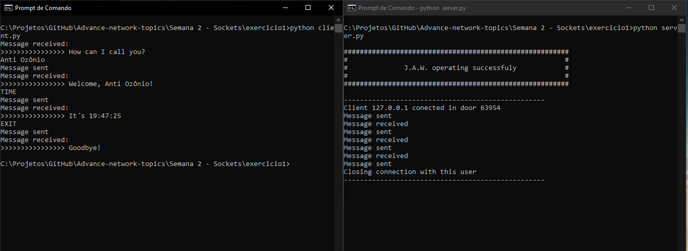

### Commands

List all commands available in the server.

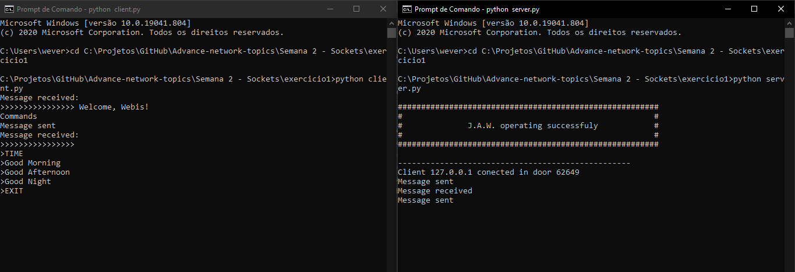

### Time

Shows the current time in the server.


### Good Morning, Good Afternoon, Good Night

The J.A.W answers your greeting and corrects it if it's not appropriate for the current time.

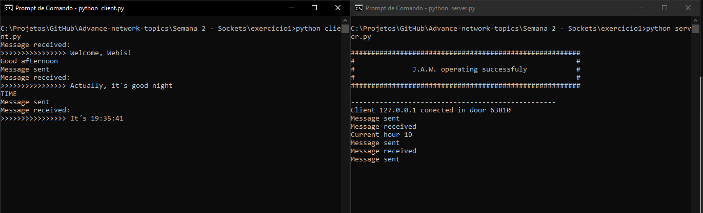

### Exit

Ends connection with the server.

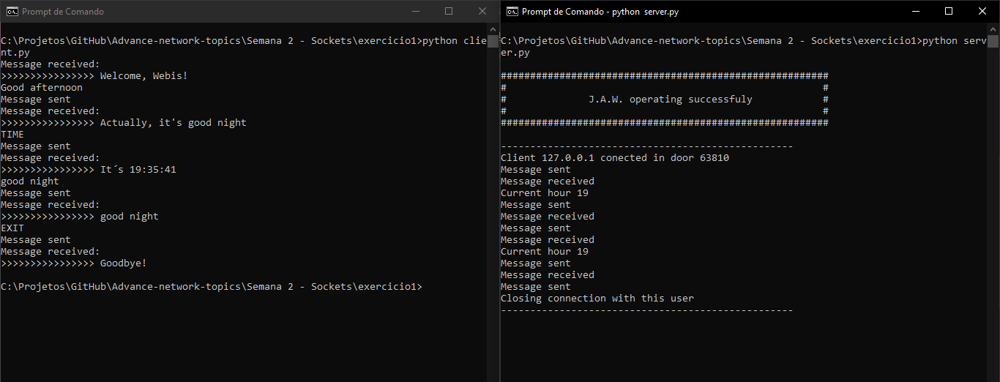


<p align="center">
  <br/></br><a href="#semana-2---sockets">⬆⬆⬆VOLTAR PARA O TOPO⬆⬆⬆</a><br/><br/><br/>
</p>


## Exercício 2

### Run Server
```terminal
python server.py
```
### Run Client
```terminal
python client.py
```

### Command

* [Make math operation plus](#make-math-operation-plus)
* [Make math operation minus](#make-math-operation-minus)
* [Make math operation divide](#make-math-operation-divide)
* [Make math operation multiply](#make-math-operation-multiply)

### First Access

In the first access the server will send the client a welcoming message

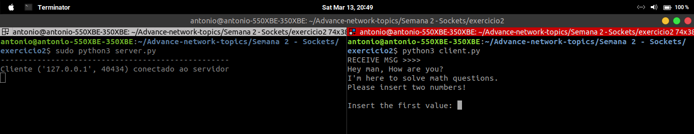

### Make math operation plus

Asks the client for the two numbers and the code of the oeration, in this case the first operation.

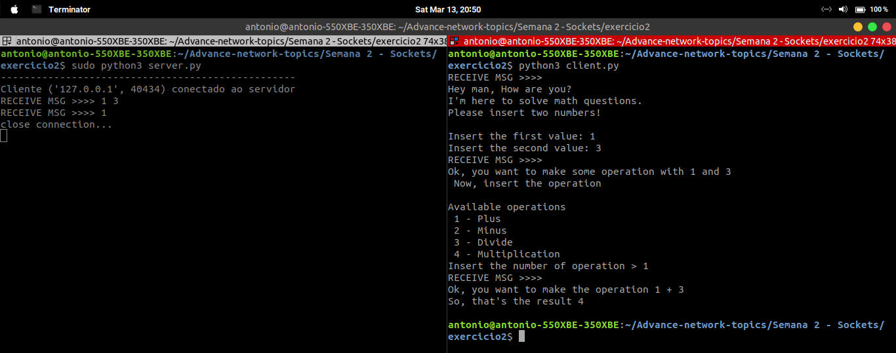

### Make math operation minus

Asks the client for the two numbers and the code of the oeration, in this case the second operation

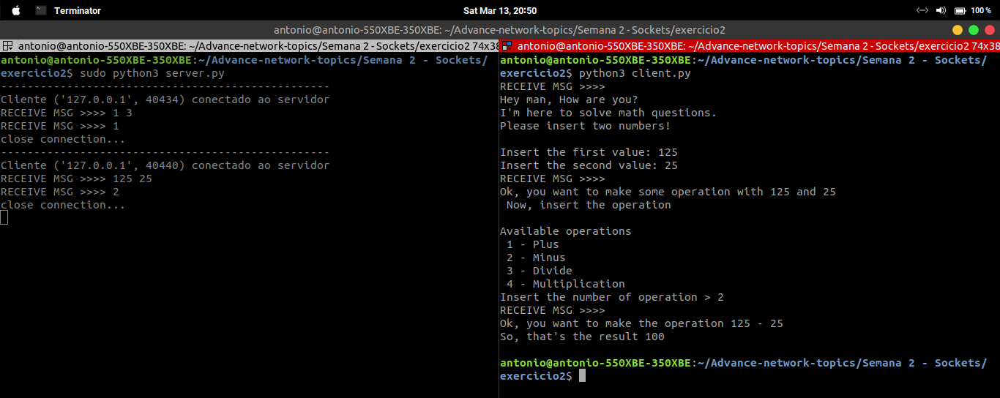

### Make math operation divide

Asks the client for the two numbers and the code of the oeration, in this case the third operation

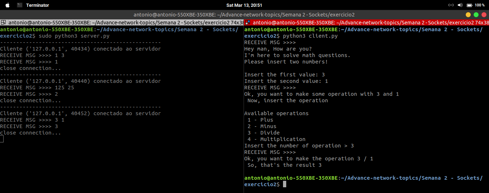

### Make math operation multiply

Asks the client for the two numbers and the code of the oeration, in this case the fourth operation

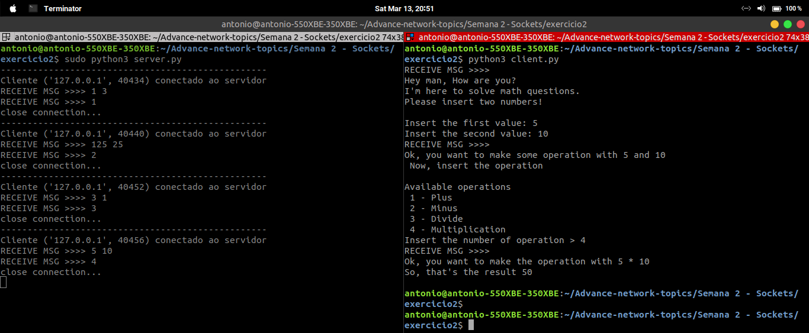


<p align="center">
  <br/></br><a href="#semana-2---sockets">⬆⬆⬆VOLTAR PARA O TOPO⬆⬆⬆</a><br/><br/><br/>
</p>


## Exercício 3

### Run Server
```terminal
python server.py
```
### Run Client
```terminal
python client.py
```

### Available Commands (without case-sensitive)

* [COMMANDS](#commands-1)
* [TIME](#time-1)
* [Good Morning, Good Afternoon, Good Night](#good-morning-good-afternoon-good-night-1)
* [EXIT](#exit-1)

### First Access

In a client's first access the J.A.W asks for the client's name, so it can store it and know what to call this client the next time he/she connects to the server.

#### Linux
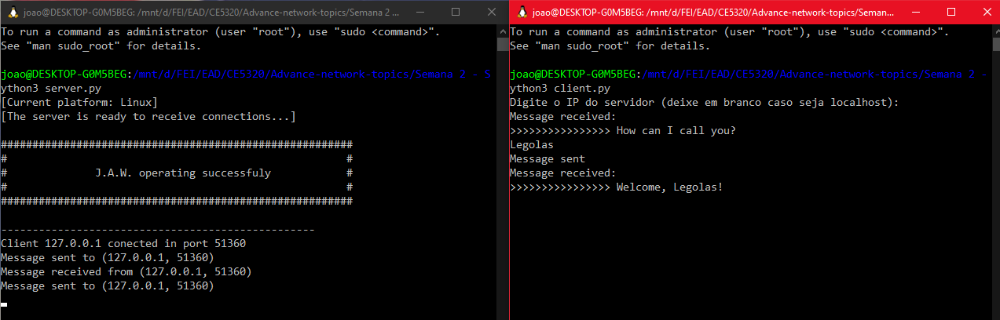

#### Windows
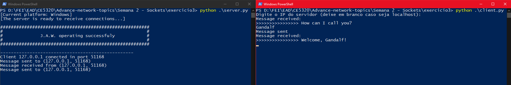

### Commands

List all commands available in the server.

#### Linux
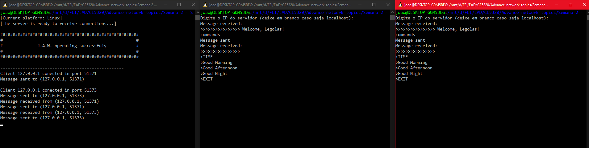

#### Windows
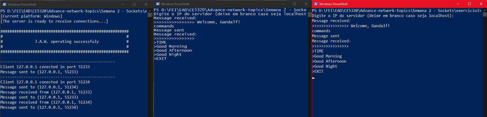

### Time

Shows the current time in the server.

#### Linux
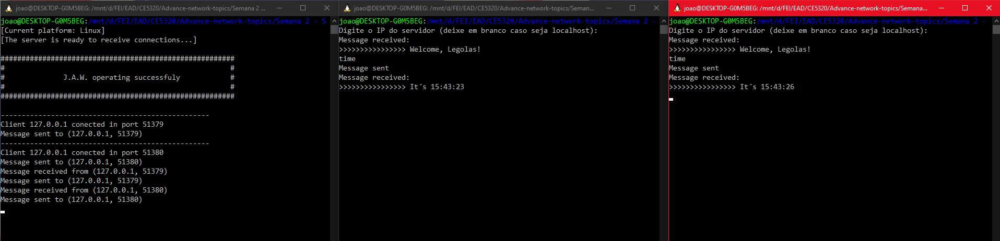

#### Windows
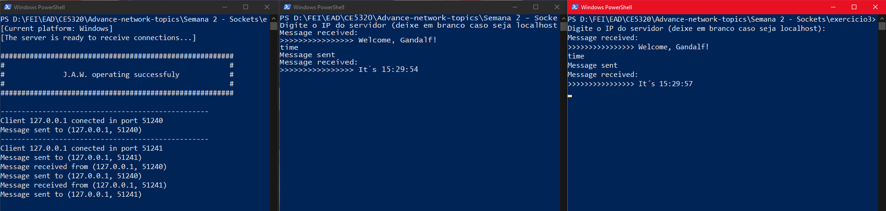

### Good Morning, Good Afternoon, Good Night

The J.A.W answers your greeting and corrects it if it's not appropriate for the current time.

#### Linux
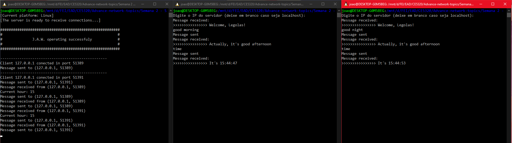

#### Windows
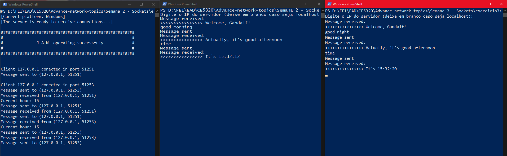

### Exit

Ends connection with the server.

#### Linux
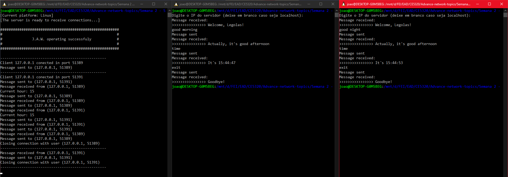

#### Windows
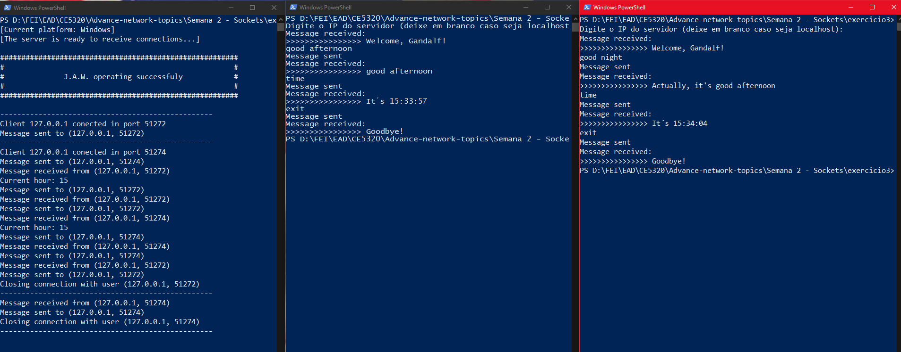


<p align="center">
  <br/></br><a href="#semana-2---sockets">⬆⬆⬆VOLTAR PARA O TOPO⬆⬆⬆</a><br/><br/><br/>
</p>
